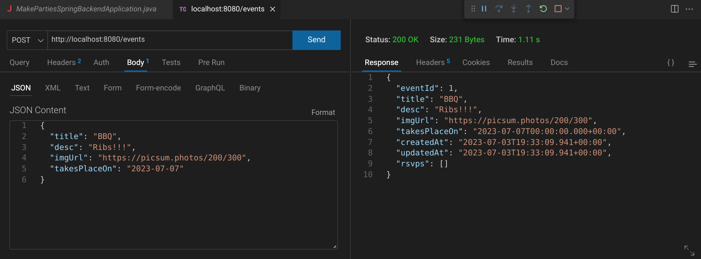
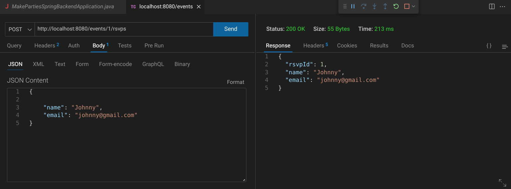
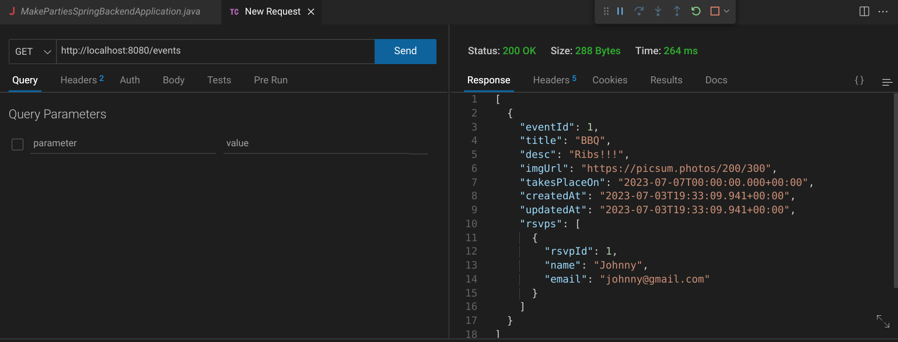
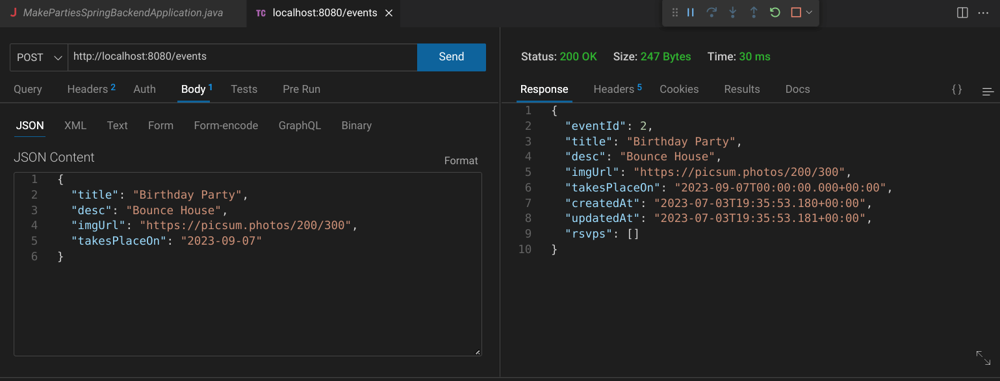
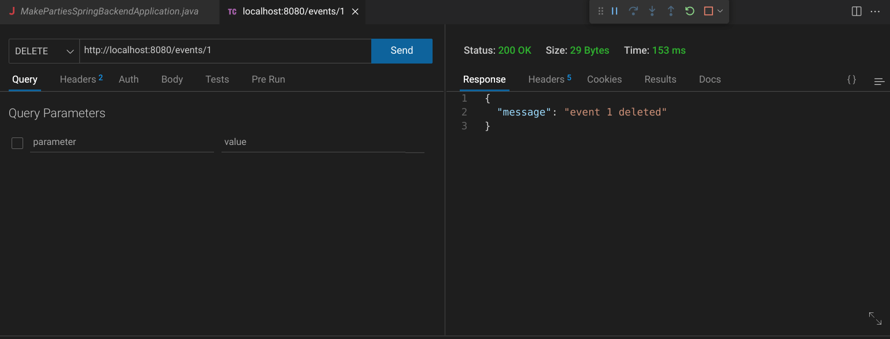
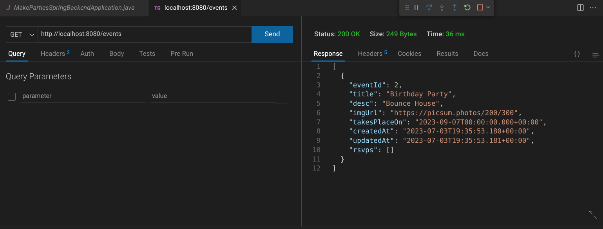

# Make Parties Spring Backend

This is a conversion of a [past MakeSchool tutorial I completed](https://github.com/jdegand/makeparties) to Spring Boot.

## Screenshots

***

***

***

***

***

***

***

## Built with

- Java 17
- Spring Boot 3.1
- H2 Console
- Lombok

## Thoughts

- Doing the mappings between entities is easy, but there can be a few gotchas.
- With Event and Rsvp, there exists a cyclic dependency and you get a stack overflow if you try to get Event - either use an annotation or a dto. See [Stack Overflow](https://stackoverflow.com/questions/61993704/stack-overflow-error-for-hibernate-one-to-one-mapping-with-spring-data-jpa) for more.  
- Having to use DTOs with mappings (ManyToOne etc) is glossed over and obscured in a lot of implementations.
- Using DTOs requires extra work -> easier to create a bug.
- `@JsonBackReference` can't be used on a collection.
- Could add a third table for the list of rsvps -> `@JoinTable`
- Using Builder on an entity with a mapping warns - "@Builder will ignore the initializing expression entirely. If you want the initializing expression to serve as default, add @Builder.Default. If it is not supposed to be settable during building, make the field final." -> Because I set rsvps to an empty list, I needed to use `@Builder.Default` annotation on rsvps.
- Added `takesPlaceOn` to the `Event` entity (stretch challenge in original MakeSchool tutorial).
- Added timestamps as well but I did not use them in the frontend.
- Added validation after I had the frontend working with the backend.
- The tutorial did not feature any validation.
- I kept the validation fairly minimal -  a few required properties and date validation for takesPlaceOn.
- In the entities, I used `{entity}Id` instead of just id.  This can be annoying and it is debatable if this is a good practice.
- Tests were written in this order: repository layer, service layer, and controller layer.
- I am not sure if it is truly necessary to test methods that just use JPARepository methods - seems redundant - this project didn't use any custom queries.
- However, the repository tests are easy to write.
- Had trouble with using `Optional` and `thenReturn` together in the EventService Tests - the commented out code seems like it should work but maybe I missed something - could be the return type of the function - i.e. `Optional<Event>` vs. `Event`
- You need to use `assertAll()` to handle void methods ie delete.
- Not using response entities does create problems when testing error states in the controller layer because requests will fail without giving the appropriate status code.  You have to write more checks to test routes versus stopping after `isBadRequest()`, etc.

## Continued Development

- Use `ResponseEntity` for all routes?
- Better exception handling / custom exceptions
- The validation for event put requests needs improvement. Need to check `takesPlaceOn` is a valid date.
- `fetchEventById` in the event service implementation could probably be refactored and done in a better way

## Useful Resources

- [YouTube](https://www.youtube.com/watch?v=qIRm6hXlghs) - OneToMany | ManyToOne Relationship In Hibernate | SpringBoot | JPA | Java
- [Stack Overflow](https://stackoverflow.com/questions/37541168/code-architecture-of-service-interface-and-service-impl-classes-spring) - code architecture of service interface and service implementation
- [Stack Overflow](https://stackoverflow.com/questions/49254104/spring-boot-timestamp) - timestamps
- [YouTube](https://www.youtube.com/watch?v=j8J9Cx8pEsI) - Build REST API with Spring Boot and JPA [2021] - 25 Create timestamps by JPA
- [YouTube](https://www.youtube.com/watch?v=OMmxqc9zdSg) - Spring Boot For Beginners - One-To-Many in Spring Data
- [Baeldung](https://www.baeldung.com/circular-dependencies-in-spring) - circular dependencies
- [Stack Overflow](https://stackoverflow.com/questions/47640698/com-fasterxml-jackson-databind-ser-beanserializer-serialize-spring-jpa) - fasterxml jackson stack overflow
- [Github](https://github.com/teddysmithdev/pokemon-review-springboot) - pokemon review springboot
- [Stack Overflow](https://stackoverflow.com/questions/64246525/onetomany-column-not-showing) - one to many column not showing
- [Stack Overflow](https://stackoverflow.com/questions/61993704/stack-overflow-error-for-hibernate-one-to-one-mapping-with-spring-data-jpa) - stack overflow for hibernate one to one mapping
- [Stack Overflow](https://www.baeldung.com/jackson-bidirectional-relationships-and-infinite-recursion) - bidirectional relationships and infinite recursion
- [YouTube](https://www.youtube.com/watch?v=5HAzLAnJPKU) - 40 Enable CORS in Spring Boot
- [Stack Overflow](https://stackoverflow.com/questions/53431292/spring-implementation-of-cors-is-not-rejecting-messages-when-i-expected-it-to) - cors is not rejecting messages when i expect
- [Stack Overflow](https://stackoverflow.com/questions/18385361/return-json-for-responseentitystring) - return json for response entity
- [YouTube](https://www.youtube.com/watch?v=JmMXQaSYl4Y) - Spring Boot tutorials | Spring boot full course - How to use ResponseEntity in REST API?
- [Stack Overflow](https://stackoverflow.com/questions/54438313/implement-status-200-when-delete-is-send) - implement status 200 when delete is sent
- [Stack Overflow](https://stackoverflow.com/questions/5478328/in-which-case-do-you-use-the-jpa-jointable-annotation) - jpa jointable annotation
- [Baeldung](https://www.baeldung.com/java-string-valid-date) - java string valid date
- [How to Do in Java](https://howtodoinjava.com/java/date-time/date-validation/) - date validation
- [Baeldung](https://www.baeldung.com/lombok-builder-default-value) - lombok builder default value
- [Stack Overflow](https://stackoverflow.com/questions/46057360/how-to-suppress-lombok-warnings) - suppress lombok warnings
- [YouTube](https://www.youtube.com/watch?v=jqwZthuBmZY&list=PL82C6-O4XrHcg8sNwpoDDhcxUCbFy855E&index=1) - Spring Boot Unit Testing Tutorial (W/ Mockito)
- [Stack Overflow](https://stackoverflow.com/questions/30946167/mockito-error-with-method-that-returns-optionalt) - mockito error with method that returns optional
- [Baeldung](https://www.baeldung.com/java-init-list-one-line) - java init list one line
- [YouTube](https://www.youtube.com/watch?v=XASyDbfQYaw) - Write Unit Test Case For Controller Layer using Junit & Mockito | @WebMvcTest | MockMvc
